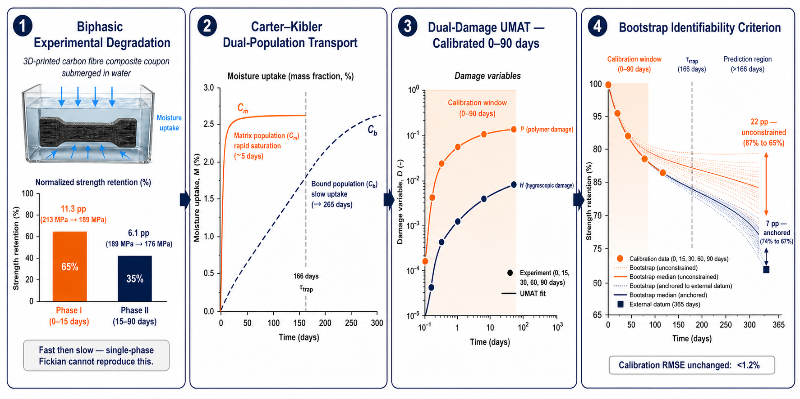

# hygro-dual-damage-UMAT

A hygro-dual-damage constitutive framework with uncertainty quantification
for durability prediction of 3D-printed carbon fibre-reinforced nylon composites.




> **Associated journal paper (under review):** Irfan Irfan, *A Hygro-Dual-Damage
> Constitutive Framework with Uncertainty Quantification for Durability Prediction
> of 3D-Printed Carbon Fibre-Reinforced Nylon Composites*, 2026. *(manuscript in preparation)*

> **Thesis (open access):** Irfan Irfan, *Coupled Hygro-Viscoelastic Dual-Damage
> UMAT for 3D-Printed CF/Onyx Composites*, LUT University, 2026.
> [URN:NBN:fi-fe2026060260742](https://urn.fi/URN:NBN:fi-fe2026060260742)

---

## Overview

This repository provides the FORTRAN UMAT subroutine and experimental validation
data accompanying the journal paper listed above. The constitutive framework models
moisture-driven degradation in 3D-printed carbon fibre-reinforced nylon (CF/Onyx)
composites and integrates:

- Carter–Kibler dual-population moisture transport
- Reversible plasticisation damage (mobile moisture driven)
- Irreversible hydrolytic damage (bound moisture driven)
- Bootstrap-based parametric uncertainty quantification

**Four-step research narrative:**
biphasic experimental degradation → Carter–Kibler dual-population transport →
dual-damage UMAT calibrated 0–90 days → bootstrap identifiability criterion

---

## Repository Structure

```text
hygro-dual-damage-UMAT/
├── UMAT/
│   └── hygro_dual_damage_UMAT.for     # Main FORTRAN UMAT source
├── Python_surrogate/
│   ├── surrogate.py                   # Surrogate model and post-processing
│   ├── bootstrap_uq.py                # Parametric bootstrap UQ workflow
│   └── sensitivity_oat.py            # One-at-a-time sensitivity analysis
├── data/
│   ├── README_data.md                 # Data description               
│   └── tensile_data.csv               # Tensile stress–strain (0--90 day)
├── figures/
│   ├── graphical_abstract.png
│   ├── calibration_fit.png
│   ├── bootstrap_ci.png
│   ├── damage_evolution.png
│   └── sensitivity_oat.png
├── examples/
│   └── verification_example.inp       # Abaqus verification input file
├── docs/
│   └── theory_notes.pdf               # Constitutive model derivations
├── CITATION.cff
├── LICENSE
└── README.md
```

---

## Experimental Data

Tensile characterisation data for CF/Onyx specimens conditioned in distilled
water at 26 °C (0–90 days) is available in the `data/` folder.
See [`data/README_data.md`](data/README_data.md) for full descriptions.

| File | Conditioning | Description |
|------|-------------|-------------|
| `tensile_T0.csv` | 0 days (dry) | As-printed baseline |
| `tensile_T15.csv` | 15 days | Post-immersion tensile data |
| `tensile_T30.csv` | 30 days | Post-immersion tensile data |
| `tensile_T60.csv` | 60 days | Post-immersion tensile data |
| `tensile_T90.csv` | 90 days | Post-immersion tensile data |

---

## UMAT Implementation — Key Algorithms

The UMAT executes two coupled procedures at every integration point using a
backward-Euler implicit scheme. Full derivations are provided in the thesis
(URN:NBN:fi-fe2026060260742) and the accompanying journal paper.

### A.1 — Carter–Kibler Moisture Diffusion

The coupled mobile/bound moisture ODE system is solved by a 2×2 linear system
inverted with Cramer's rule. A fallback to explicit Euler is triggered if the
determinant falls below 10⁻²⁰.

```fortran
IF (dtimedays .GT. 0.D0) THEN
   CKA(1,1) = 1.D0 + dtimedays*(1.D0/taudiffdays + betatrap)
   CKA(1,2) = dtimedays*(1.D0/taudiffdays) - kappa
   CKA(2,1) = -dtimedays*betatrap
   CKA(2,2) = 1.D0 + dtimedays*kappa
   CKB(1)   = Cm + dtimedays*(Csat/taudiffdays)
   CKB(2)   = Cb
   DET = CKA(1,1)*CKA(2,2) - CKA(1,2)*CKA(2,1)
   IF (ABS(DET) .LT. 1.D-20) THEN
      Cm_new = Cm + dtimedays*((Csat-Cm-Cb)/taudiffdays
     &          - betatrap*Cm + kappa*Cb)
      Cb_new = Cb + dtimedays*(betatrap*Cm - kappa*Cb)
   ELSE
      Cm_new = (CKB(1)*CKA(2,2) - CKA(1,2)*CKB(2)) / DET
      Cb_new = (CKA(1,1)*CKB(2) - CKA(2,1)*CKB(1)) / DET
   END IF
   Cm = MAX(0.D0, MIN(Csat, Cm_new))
   Cb = MAX(0.D0, MIN(Csat-Cm, Cb_new))
END IF
Ctotal = MAX(0.D0, MIN(Csat, Cm + Cb))
```

> **State variables:** `STATEV(1)` → Cₘ (mobile moisture), `STATEV(2)` → C_b (bound moisture)

---

### A.2 — Dual-Damage Evolution Laws

Reversible plasticisation `P_i` (driven by mobile moisture Cₘ) and irreversible
hydrolytic damage `H_i` (driven by bound moisture C_b) are updated separately.
The hydrolytic ratchet enforces `H_i` to be monotonically non-decreasing.
Effective stiffness is degraded as:

**E_eff = E₀ · (1 − P̄) · (1 − H̄)**

```fortran
! Reversible plasticisation driven by mobile moisture Cm
DO I=1,3
   IF (Cm .GT. 1.D-10) THEN
      P_target = 1.D0 - DEXP(-kP(I)*(Cm**mP))
   ELSE
      P_target = 0.D0
   END IF
   IF (dtime_days .GT. 0.D0 .AND. tauP_days .GT. 0.D0) THEN
      expm = DEXP(-dtime_days/tauP_days)
      P(I) = P_target + (P(I) - P_target)*expm
   ELSE
      P(I) = P_target
   END IF
   P(I) = MAX(0.D0, MIN(0.99D0, P(I)))
END DO

! Irreversible hydrolysis driven by bound moisture Cb
DO I=1,3
   IF (Cb .GT. 1.D-10 .AND. dtime_days .GT. 0.D0) THEN
      expm     = DEXP(-kH(I)*(Cb**mH)*dtime_days)
      H_target = 1.D0 - (1.D0 - H(I))*expm
      H(I)     = MAX(H(I), H_target)   ! irreversible ratchet
   END IF
   H(I) = MAX(0.D0, MIN(0.99D0, H(I)))
END DO

! Effective stiffness degradation
Pbar = (P(1)+P(2)+P(3))/3.D0
Hbar = (H(1)+H(2)+H(3))/3.D0
damage_factor = (1.D0 - Pbar)*(1.D0 - Hbar)
damage_factor = MAX(0.01D0, MIN(1.D0, damage_factor))

DO I=1,6
   DO J=1,6
      DDSDDE(I,J) = damage_factor * Cij(I,J)
   END DO
END DO
STRESS = MATMUL(DDSDDE, STRAN + DSTRAN)
```

> **State variables:** `STATEV(3:5)` → P_i (plasticisation), `STATEV(6:8)` → H_i (hydrolytic damage)

---

## Python Surrogate — Bootstrap UQ Workflow

From `Python_surrogate/bootstrap_uq.py`. Reproduces durability prediction
intervals without an Abaqus runtime.

```python
import numpy as np
from scipy.optimize import minimize

def ck_surrogate(t, params):
    """Carter-Kibler dual-population moisture saturation model."""
    C_inf, kA, kB = params
    C_bound  = C_inf * kB / (kA + kB)
    C_mobile = C_inf * kA / (kA + kB)
    return (C_mobile * (1 - np.exp(-kA * t))
          + C_bound  * (1 - np.exp(-kB * t)))

# Parametric bootstrap (n=1000) for parameter identifiability
rng = np.random.default_rng(42)
boot_params = np.zeros((1000, 3))
for i in range(1000):
    idx = rng.integers(0, len(t_data), len(t_data))
    res = minimize(residual, p0,
                   args=(t_data[idx], E_data[idx]),
                   method='Nelder-Mead')
    boot_params[i] = res.x

ci_lower, ci_upper = np.percentile(boot_params, [2.5, 97.5], axis=0)
```

**Key finding:** A model achieving <1.2 % RMSE over 90 days still carries
±22 pp one-year prediction uncertainty — reducible only by data beyond the
bound-moisture trapping timescale (τ_trap ≈ 166 days).

---

## Results Gallery


.pdf) |


---

## How to Use

1. Copy `UMAT/hygro_dual_damage_UMAT.for` into your Abaqus working directory.
2. Reference the subroutine in your `.inp` file with `*USER MATERIAL`.
3. Run the verification case in `examples/verification_example.inp`.
4. Use the Python scripts in `Python_surrogate/` to reproduce sensitivity
   and bootstrap UQ analyses.

```text
Abaqus .inp → UMAT simulation → Python surrogate → sensitivity analysis → bootstrap UQ → figures
```

---

## Citation

If you use this repository, please cite both the journal paper and the thesis:

**Journal paper (primary reference):**
```bibtex
@article{irfan2026hygrodamage,
  author  = {Irfan Irfan, Marcelo L Ribeiro, José Humberto S Almeida Jr},
  title   = {A Hygro-Dual-Damage Constitutive Framework with Uncertainty
             Quantification for Durability Prediction of {3D}-Printed
             Carbon Fibre-Reinforced Nylon Composites},
  journal = {(under review)},
  year    = {2026}
}
```

**Thesis (theoretical foundation and full derivations):**
```bibtex
@mastersthesis{irfan2026thesis,
  author  = {Irfan Irfan},
  title   = {Coupled Hygro-Viscoelastic Dual-Damage {UMAT} for
             3D-Printed {CF/Onyx} Composites},
  school  = {LUT University},
  year    = {2026},
  address = {Lappeenranta, Finland},
  url     = {https://urn.fi/URN:NBN:fi-fe2026060260742}
}
```

A `CITATION.cff` is included for automated citation by GitHub, Zenodo, and Zotero.

---

## License

Licensed under [CC BY 4.0](https://creativecommons.org/licenses/by/4.0/).
You are free to share and adapt this material for any purpose, including
commercially, as long as you give appropriate credit and indicate any changes.

© 2026 Irfan Irfan, LUT University
